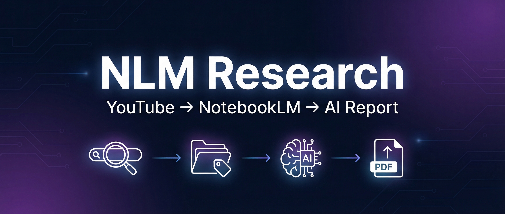
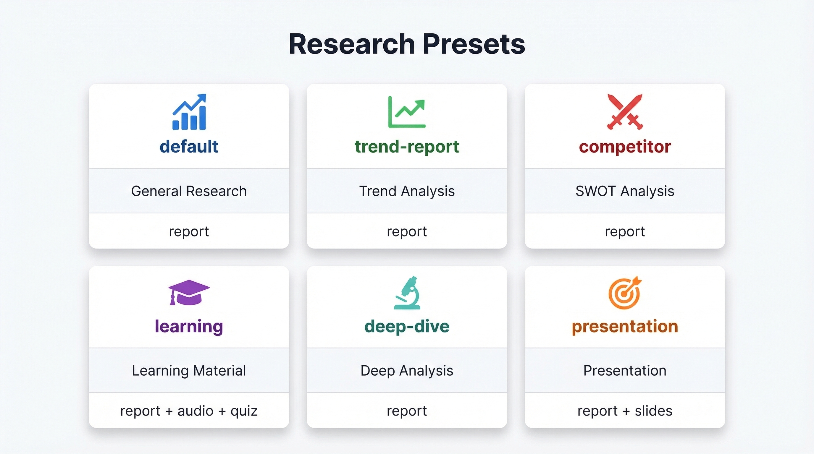
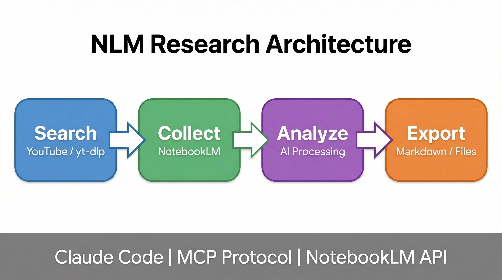
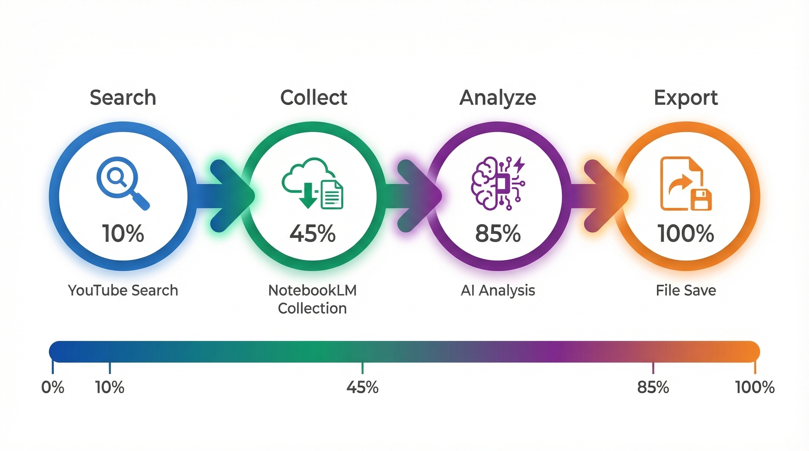
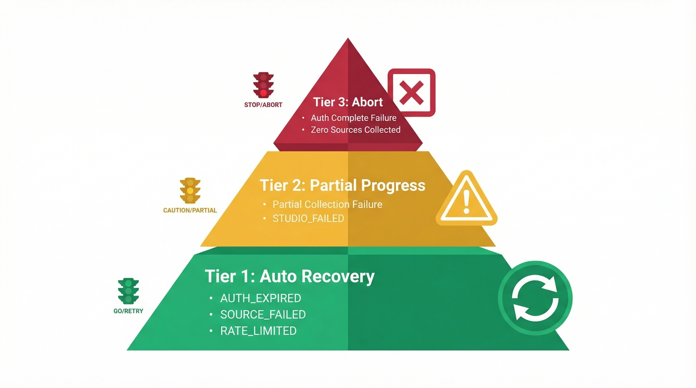

<!-- hero banner -->
<p align="center">
  
</p>

<p align="center">
  <a href="https://docs.anthropic.com/claude-code"></a>
  <a href="https://notebooklm.google.com"></a>
  <a href="LICENSE"></a>
</p>

<p align="center">
  <strong>Type a topic, and AI finds YouTube videos, analyzes them, and creates podcasts, slides, and reports for you</strong>
</p>

<p align="center">
  <a href="README.md">한국어</a> | <strong>English</strong>
</p>

---

# NLM Research

Type a topic you're curious about, and this tool finds related YouTube videos, has AI analyze them, and turns them into various content formats — automatically.

## What You Can Create

| Content | Description | Perfect for... |
|---------|-------------|---------------|
| 🎧 AI Podcast | Two AI hosts discuss the topic in a natural audio conversation (.mp3) | Learning on your commute — just listen and absorb |
| 📊 Briefing Report | A clean, structured summary document (.md) | 5-minute read before a meeting |
| 🎬 Presentation Slides | Auto-generated slide deck (.pptx) | Cutting your presentation prep time dramatically |
| 🧠 Mind Map | Visual map showing how topics connect | Seeing the big picture of complex subjects fast |
| 💬 AI Q&A | Ask questions about your collected sources and get instant answers | When you don't have time to watch hours of video |
| 🌐 Web Research | AI automatically finds more related sources from the web | When you need broader perspectives |

> All of this happens **with a single command**.
> Just type a topic, and the system finds YouTube videos, feeds them to AI, generates your chosen content, and saves everything to your computer.

## How to Get Started

### Step 1: Install the tools

These are the building blocks that make everything work.

**Claude Code** — The AI assistant that runs everything

Follow the [official install guide](https://docs.anthropic.com/claude-code), then verify:
```bash
claude --version
```

**Deno** — Required to run the nlm tool

```bash
curl -fsSL https://deno.land/install.sh | sh
deno --version    # verify
```

**nlm** — Connects to Google NotebookLM

```bash
deno install -gArf jsr:@nicholasgriffintn/notebooklm-cli
nlm --version     # verify
```

**yt-dlp** — Enables YouTube search

```bash
pip install yt-dlp
yt-dlp --version  # verify
```

### Step 2: Connect your Google account

NotebookLM needs Google sign-in. Run this once and follow the browser prompt:

```bash
nlm login
```

### Step 3: Run your first research

```bash
cd nlm-research   # Navigate to this folder
claude            # Start the AI assistant

# Now type this:
/research run AI agent trends --auto
```

Add `--auto` to run everything automatically without pausing. Remove it if you want to approve each step.

## Use Case Guide

<p align="center">
  
</p>

Choose the scenario that fits your needs.

### "I have a presentation tomorrow and no slides"

```bash
/research run 2026 AI market outlook --preset presentation --auto
```
You get a 📊 briefing report + 🎬 slide deck (.pptx) automatically.

### "I want to learn a new technology quickly"

```bash
/research run React 19 new features --preset learning --auto
```
You get a 📊 study guide + 🎧 AI podcast (mp3) + 📝 quiz.

### "I need to understand market trends"

```bash
/research run AI agent 2026 trends --preset trend-report --auto
```
You get a 📊 trend analysis briefing report.

### "I need a competitor analysis"

```bash
/research run competitor-X product review --preset competitor --auto
```
You get a 📊 SWOT analysis report.

### "I want to go deep on a topic"

```bash
/research run LLM architecture comparison --preset deep-dive --auto
```
AI finds additional web sources and creates a 📊 deep analysis report.

### "Just a quick research summary"

```bash
/research run AI agents --auto
```
Default preset: 📊 briefing report + 💬 Q&A analysis.

## How It Works

<p align="center">
  
</p>

Think of it like a research assistant: finds relevant books (search) → borrows them from the library (collect) → reads and summarizes them (analyze) → prints the report (export) — all done by AI.

<p align="center">
  
</p>

| Step | What happens | Think of it as... |
|------|-------------|-------------------|
| 🔍 Search | Finds related YouTube videos for your topic | Finding relevant books at the library |
| 📚 Collect | Adds those videos to NotebookLM | Borrowing the books |
| 🧠 Analyze | AI analyzes everything and creates your outputs | Reading and summarizing |
| 📤 Export | Saves the finished files to your computer | Printing the report |

## Files You'll Get

Everything is automatically saved by topic under `~/research-output/<topic>/`.

```
~/research-output/
├── AI_agent_trends/
│   ├── AI_agent_trends_report.md          # Briefing report
│   ├── AI_agent_trends_analysis.md        # Q&A deep analysis
│   ├── AI_agent_trends_podcast.mp3        # AI podcast audio
│   ├── AI_agent_trends_quiz.json          # Learning quiz
│   └── AI_agent_trends_slides.pptx        # Presentation slides
├── last_session.json                       # Last session reference
└── research_sessions.jsonl                 # Session history
```

| File | What it is | Which presets create it |
|------|-----------|----------------------|
| `*_report.md` | A structured briefing document synthesized by AI | All presets |
| `*_analysis.md` | Deep insights from AI Q&A sessions | All presets |
| `*_podcast.mp3` | An audio conversation between two AI hosts | learning |
| `*_quiz.json` | A quiz to test your understanding | learning |
| `*_slides.pptx` | A ready-to-present slide deck | presentation |

## Fine-tuning Your Research

### Search options

| Option | What it does | Default |
|--------|-------------|---------|
| `-n <number>` | How many YouTube results to fetch | 10 |
| `-d` | Sort by newest first | off |

### Run options

| Option | What it does | Default |
|--------|-------------|---------|
| `--auto` | Run without asking for confirmation | off |
| `--preset <name>` | Choose a preset (see Use Case Guide above) | default |
| `--top <N>` | How many top videos to actually use | depends on preset |
| `--notebook <id>` | Add to an existing notebook instead of creating a new one | create new |
| `--lang <code>` | Language for generated content (e.g., `en`, `ko`) | ko |

### What's the difference between `-n` and `--top`?

- **`-n`** controls how many videos to **search for** on YouTube
- **`--top`** controls how many of those videos to actually **use**

```bash
# Search 15 videos, but only use the top 3
/research run AI -n 15 --top 3 --auto
```

### Step-by-step manual execution

Instead of running everything automatically, you can run each step yourself:

```bash
/research search AI agents              # 1. Search YouTube
/research collect                        # 2. Collect selected videos into NotebookLM
/research analyze <notebook-id>          # 3. AI analysis
/research export <notebook-id>           # 4. Export files
/research status                         # Check current progress
```

## If Something Goes Wrong

<p align="center">
  
</p>

The system handles problems at three levels:

- 🟢 **Most issues fix themselves.** Things like expired login sessions are refreshed automatically. Rate limits are waited out and retried.
- 🟡 **Partial failures are skipped gracefully.** If one video can't be added (maybe it's private or deleted), the system skips it and continues with the rest.
- 🔴 **Serious problems stop the process and tell you what to do.** For example, if your login is completely broken or no videos were found at all.

### Common fixes

| What you see | What to do |
|-------------|-----------|
| "NotebookLM authentication required" | Run `nlm login` in your terminal |
| A specific video fails to load | It's probably private or deleted — the system skips it automatically |
| Report generation fails | You may have too few or too many sources — check with `/research status` |
| 0 sources collected | Try different search keywords |

## Project Structure

```
nlm-research/
├── README.md                               # Documentation (Korean)
├── README_EN.md                            # Documentation (English)
├── assets/                                 # Images used in documentation
├── .claude/commands/research/
│   ├── SKILL.md                           # Command router
│   ├── DESIGN.md                          # System design document
│   ├── run.md                             # Full automated flow
│   ├── search.md                          # YouTube search
│   ├── collect.md                         # Source collection
│   ├── analyze.md                         # AI analysis
│   ├── export.md                          # File export
│   ├── status.md                          # Session status
│   ├── scripts/
│   │   └── youtube_search.py              # YouTube search script
│   └── references/
│       ├── nlm-commands.md                # NotebookLM reference
│       └── workflow-examples.md           # Workflow examples
└── ~/research-output/                     # Where your files are saved
```

## Contributing

Contributions are welcome! Here's how:

1. Fork this repository
2. Create a feature branch (`git checkout -b feat/amazing-feature`)
3. Commit your changes (`git commit -m 'feat: add amazing feature'`)
4. Push to the branch (`git push origin feat/amazing-feature`)
5. Open a Pull Request

## License

This project is licensed under the [MIT License](LICENSE).
